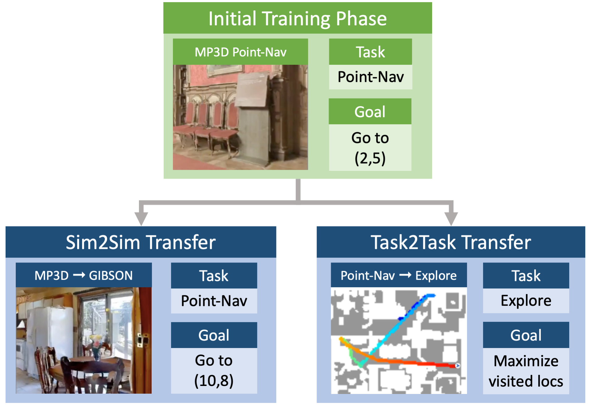

# SplitNet: Sim2Sim and Task2Task Transfer for Embodied Visual Navigation
<p align="center">
  
  </p>

## Requirements
1. Python 3.6+ (to be compatible with Habitat, though SplitNet is Python2.7 compatible).
1. Recommended: [anaconda/miniconda](https://docs.conda.io/en/latest/miniconda.html)
1. Slightly less recommended: virtualenv `pip3 install virtualenv` or `sudo apt-get install python-virtualenv`
1. A good attitude.

## First Time Setup
### Conda
1. Create your virtual environment: `conda create -n habitat-env python=3.6`
2. Run this code (replace the env name if necessary)
```bash
git clone git@github.com:facebookresearch/splitnet.git
cd splitnet
conda deactivate
conda env update -n habitat-env -f environment.yml
conda activate habitat-env
```
3. Clone and install `habitat-sim` from [the github repo](https://github.com/facebookresearch/habitat-sim#quick-installation). You must be in the same virtualenv as before.
Alternatively, run `pip install git+https://github.com/facebookresearch/habitat-sim.git@a674c5c13683a117c06820c54f5bec9c1775800d` to install it locally. Note that the `pip` method does not support headless compilation.
SplitNet's codebase is known to be compatible with https://github.com/facebookresearch/habitat-sim/commit/a674c5c13683a117c06820c54f5bec9c1775800d
4. Clone and install `habitat-api` from [the github repo](https://github.com/facebookresearch/habitat-api#installation). You must be in the same virtualenv as before.
Alternatively, run `pip install git+https://github.com/facebookresearch/habitat-api.git@5679a5dc26d5097eb14658eff91a800e18763fe6` to install it locally.
SplitNet's codebase is known to be compatible with https://github.com/facebookresearch/habitat-api/commit/5679a5dc26d5097eb14658eff91a800e18763fe6

### Virtualenv
1. Create your virtual environment: `virtualenv --python=python3.6 habitat-env && source habitat-env/bin/activate`
2. Run this code (replace the env name if necessary)
```bash
git clone git@github.com:facebookresearch/splitnet.git
cd splitnet
source habitat-env/bin/activate
pip install -r requirements.txt
```
3. Clone and install `habitat-sim` from [the github repo](https://github.com/facebookresearch/habitat-sim#quick-installation). You must be in the same virtualenv as before.
Alternatively, run `pip install git+https://github.com/facebookresearch/habitat-sim.git@a674c5c13683a117c06820c54f5bec9c1775800d` to install it locally. Note that the `pip` method does not support headless compilation.
SplitNet's codebase is known to be compatible with https://github.com/facebookresearch/habitat-sim/commit/a674c5c13683a117c06820c54f5bec9c1775800d
4. Clone and install `habitat-api` from [the github repo](https://github.com/facebookresearch/habitat-api#installation). You must be in the same virtualenv as before.
Alternatively, run `pip install git+https://github.com/facebookresearch/habitat-api.git@5679a5dc26d5097eb14658eff91a800e18763fe6` to install it locally.
SplitNet's codebase is known to be compatible with https://github.com/facebookresearch/habitat-api/commit/5679a5dc26d5097eb14658eff91a800e18763fe6

## Data
We use the data sources linked from the public habitat-api repository. You will need to individually download SUNCG, MP3D, and Gibson from their sources. [habitat-sim](https://github.com/facebookresearch/habitat-sim#datasets) and [habitat-api](https://github.com/facebookresearch/habitat-api#data) share the links to the files. We additionally use the Point-Nav datasets from habitat-api, but we also provide a script for generating new datasets.

To use the same data from the dataset:
1. Create a symlink to where you downloaded the directory containing the `scene_datasets` asset files for each of the datasets. Call this folder `data`.
```bash
ln -s /path/to/habitat/data data
```
1. Verify that this is set up in the expected way by running `ls data/scene_datasets`. You should see:
`gibson  mp3d  suncg` based on which you have downloaded.
1. Download and extract the premade training datasets by running `sh download_dataset.sh`.
1. Copy/Move the downloaded datasets into the data folder.
```bash
mv downloaded_data/* data
```

## Pretrained Weights
Edit [download_weights.sh](download_weights.sh) `WEIGHT_DIRECTORY` to be a non-existing directory where the files should be downloaded.
Download the pretrained weights for all experiments by running `sh download_weights.sh`. The download contains a README on how the files are organized.


## Training
What's the matter, you don't trust our results? Good. You shouldn't. We provide example training scripts to recreate our experiments so you don't have to trust us.

First you should look at all the options of arguments in the [arguments.py](arguments.py) file. Many of them are useful for tweaking parameters or adjusting how the learning is performed. All baselines and experiments from the paper can be recreated using various arguments, but shell scripts with these exact parameters are not provided for brevity. They can be added upon request.

### Downloading the training/val datasets
See [Data](#Data)

### Retraining the Point-Nav model
1. You may wish to modify some of the variables in the shell script file before running such as the log location, dataset, gpus to use etc. It should be fairly obvious how these work.
1. Pretrain the visual encoder/decoder: `sh supervised_learning/train_supervised_visual_only.sh`
1. Train the visual encoder and the visual, motion, and policy decoders on pointnav using Behavioral Cloning: `sh supervised_learning/train_splitnet_supervised.sh`
1. Finetune the policy, freezing the visual encoder and the visual and  motion decoders on pointnav using Behavioral Cloning: `sh supervised_learning/finetune_splitnet_policy_supervised.sh`
1. Finetune the policy, freezing the visual encoder and the visual and  motion decoders on pointnav using PPO: `sh reinforcement_learning/train_splitnet_rl.sh`
1. [reinforcement_learning/train_splitnet_rl_debug.sh](reinforcement_learning/train_splitnet_rl_debug.sh) is provided as a convenience file to show how to test code without generating lots of extra log files or updating the weights. This is useful for developing your own code. Similar arguments also work for supervised learning.
1. You can retrain the ImageNet encoder with `sh supervised_learning/train_imagenet.sh` if you really want to. But then you also have to have all the ImageNet files and that's just annoying.


### Retraining Sim2Sim
1. Copy your pretrained weights from the initial simulator to a new folder so you don't overwrite them.
1. Modify the parameters in [reinforcement_learning/train_splitnet_rl_sim2sim.sh](reinforcement_learning/train_splitnet_rl_sim2sim.sh) if need be and run it.

### Retraining Task2Task
1. Copy your pretrained weights from the initial simulator to a new folder so you don't overwrite them.
1. Modify the parameters in [reinforcement_learning/train_splitnet_rl_task2task.sh](reinforcement_learning/train_splitnet_rl_task2task.sh) if need be and run it.

## Evaluation
Evaluation can be performed during training using the `--eval-interavl` flag, but you may also wish to evaluate an individual file on its own. [eval_splitnet.sh](eval_splitnet.sh) makes this possible.
1. Edit the `DATASET`, `TASK`, and `LOG_LOCATION` in [eval_splitnet.sh](eval_splitnet.sh) and any other variables you wish.
1. By default, the code restores the most recently modified weights file in the checkpoints folder. If this is not the one you want to evaluate, you will have to edit [base_habitat_rl_runner.py](base_habitat_rl_runner.py) `restore` function to point to the proper file.
1. Run `sh eval_splitnet.sh`

## Generating Debug/Output Videos
This can be useful for visually examining the learned policies and debugging mistakes that the agent may perform. The instructions are much the same as the Evaluation section, so read that first.

1. Modify parameters in `generate_videos.sh` and run it.
1. Play back the generated videos.
1. ???
1. Profit.

## License
SplitNet is licensed under Creative Commons-Non Commercial 4.0. See the [LICENSE](LICENSE) file for details.

## Citation
```
@article{gordon2019splitnet,
  title={SplitNet: Sim2Sim and Task2Task Transfer for Embodied Visual Navigation,
  author={Gordon, Daniel and Kadian, Abhishek and Parikh, Devi and Hoffman, Judy and Batra, Dhruv},
  journal={arXiv preprint arXiv:1905.07512},
  year={2019}

}
